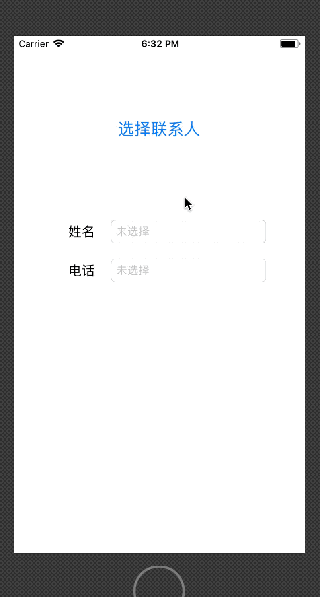

# iOS 中简单通讯录列表的使用


最近开发的App有读取用户通讯录的需要，做完这块功能之后顺便整理了一下流程，如下:

**系统: iOS 9+**

**Contacts / ContactsUI 框架**

**使用流程:**

1. 导入框架主头文件
2. 遵守协议
3. 自定义方法中创建选择联系人的控制器并弹出
4. 实现代理方法
    - 4.1取消选择
    - 4.2选择联系人


**代码如下**

```
// 1.导入头文件

#import <Contacts/Contacts.h>
#import <ContactsUI/ContactsUI.h>

// 2.遵守协议
<CNContactPickerDelegate>


// 3.此方法为button点击事件
- (void)pushContacts
{
    // 1.创建选择联系人的控制器
    CNContactPickerViewController *contactVc = [[CNContactPickerViewController alloc] init];
    // 2.设置代理
    contactVc.delegate = self;
    // 3.弹出控制器
    [self presentViewController:contactVc animated:YES completion:nil];
}


// 4.实现代理方法
// 4.1.点击取消按钮调用的方法
- (void)contactPickerDidCancel:(CNContactPickerViewController *)picker
{
    DLog(@"取消选择联系人");
}
// 4.2.当选中某一个联系人时会执行该方法
- (void)contactPicker:(CNContactPickerViewController *)picker didSelectContact:(CNContact *)contact
{
    // 1.获取联系人的姓名
    NSString *lastname = contact.familyName;
    NSString *firstname = contact.givenName;
    NSLog(@"1%@1 %@", lastname, firstname);
    
    // 2.获取联系人的电话号码(此处获取的是该联系人的第一个号码,也可以遍历所有的号码)
    NSArray *phoneNums = contact.phoneNumbers;
    CNLabeledValue *labeledValue;
    
    // 2.1这里需要单独处理一下通讯录中<我>的电话
    if (phoneNums.count) {
        labeledValue = phoneNums[0];
    }else
    {
        // 这里应该拿到自己电话号码，这里没法获取<CTSettingCopyMyPhoneNumber()这种私有API无法上架>
        CNPhoneNumber *phoneNumer = [CNPhoneNumber phoneNumberWithStringValue:@"请手动输入本机号码"];
        labeledValue = [[CNLabeledValue alloc] initWithLabel:@"无法获取" value:phoneNumer];
    }
    
    CNPhoneNumber *phoneNumer = labeledValue.value;
    NSString *phoneNumber = phoneNumer.stringValue;
    NSLog(@"%@", phoneNumber);
    // 本实例中由于要考虑，通讯录中直接添加过来的，所以自己去除一下(182-1203-0974)和(182 1203 0974)这种类型的
    if ([phoneNumber containsString:@"-"]) {
        phoneNumber = [phoneNumber stringByReplacingOccurrencesOfString:@"-" withString:@""];
    }
    if ([phoneNumber containsString:@" "]) {
        phoneNumber = [phoneNumber stringByReplacingOccurrencesOfString:@" " withString:@""];
    }
    
    NSString *userName = [NSString stringWithFormat:@"%@ %@", lastname, firstname];
    if ([userName containsString:@" "]) {
        userName = [userName stringByReplacingOccurrencesOfString:@" " withString:@""];
    }
    
    self.userNameTF.text = userName;
    self.userPhoneTF.text = phoneNumber;
}

```

**程序效果**




**源代码地址**

代码地址：https://github.com/xiaoyouPrince/SomeUIDemos

Blog地址：http://xiaoyouPrince.com/

